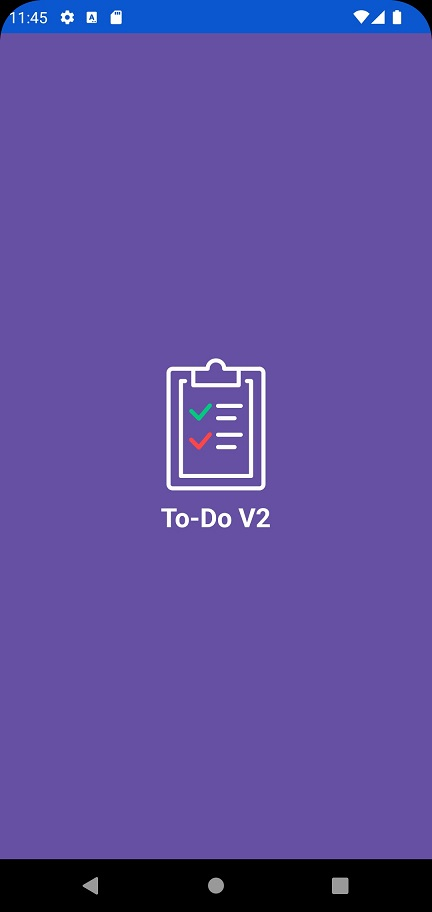
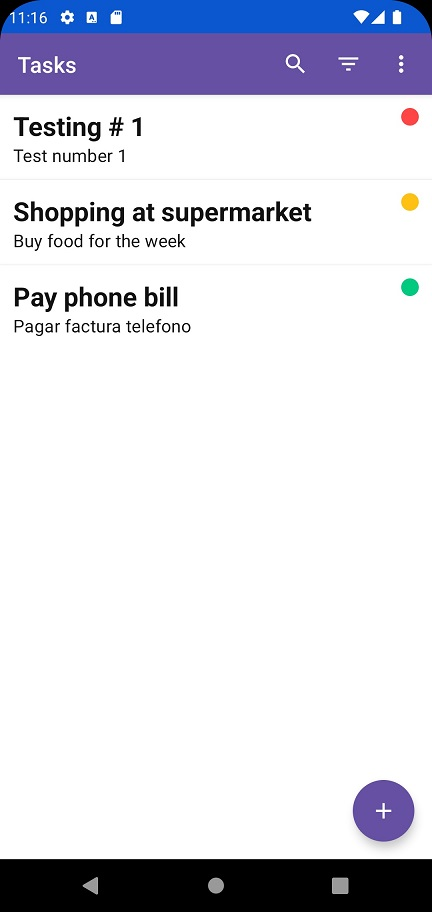
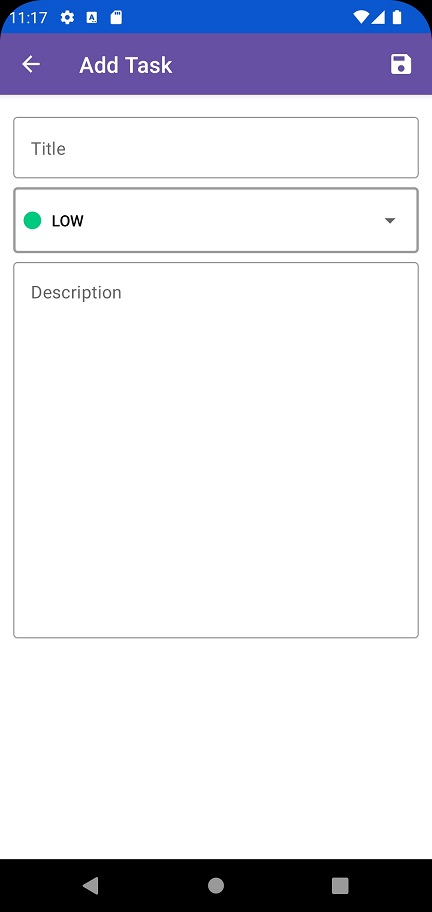
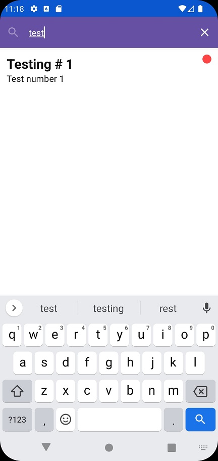
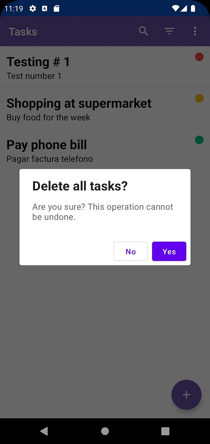

# AS-Compose-MVVM-ToDoV2
To-Do application version 2, made with Jetpack Compose.

## Architecture Used
MVVM Architecture

## Libraries
- Room
- DataStore Preferences
- Dagger-Hilt
- Accompanist Navigation
- Material icons extended

## Output
 ### Splash Screen

 ### Main Screen

 ### Add Task Screen

 ### Update Task Screen

 ### Search Screen

 ### Delete All Action

